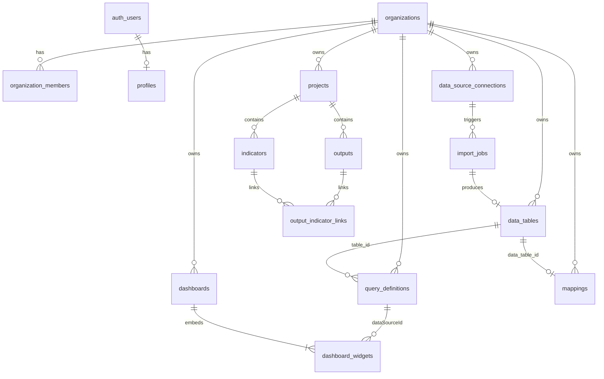

# DIMES-BI — Supabase Backend Plan

**Version:** 0.1 Draft  
**Date:** July 2026  
**Status:** Pre-implementation inventory  
**Related:** [product-spec.md](./product-spec.md) · [description.md](./description.md) · [implementation-plan.md](./implementation-plan.md)

This document inventories all data the app creates or consumes today, identifies gaps between the current demo and the product spec, and recommends what to store in Supabase before auth, signup, and backend implementation begin.

---

## 1. Executive summary

**Today:** bi-dimes is a browser-local demo. There is no authentication, no organization model, and no server API. Domain data lives in four Zustand stores; three persist fully to `localStorage`, one partially.

**Goal:** Connect Supabase for user signup/login, multi-tenant workspaces, and durable storage of datasets, queries, dashboards, mappings, and MEAL program structures — aligned with the BYOD MEAL product described in `product-spec.md`.

**Architectural decision (see §8):** Postgres (Supabase) owns metadata, auth, tenancy, RLS, and definitions; DuckDB over Parquet in Supabase Storage is the analytical query engine for imported row data. No per-import DDL — dynamic schemas are handled by a virtual table catalog + self-describing Parquet. A `jsonb` backend covers small datasets; `parquet` covers large/Enterprise. Resolves product-spec Open Q #2.

**Implementation order (recommended):**

1. Auth + organizations + memberships (foundation)
2. Tier 1 entities already persisted in the app (tables, queries, dashboards, mappings) + `jsonb` storage backend + server-side query compiler
3. Tier 2 MEAL entities (projects, outputs, indicators, links)
4. Tier 3 connector/sync infrastructure + Parquet landing path + DuckDB query layer + `indicator_values` aggregate store
5. User preferences, audit, and plan-limit enforcement

---

## 2. Current application state

### 2.1 Persistence today

| Store | `localStorage` key | What persists | What does not |
|-------|-------------------|---------------|---------------|
| `dataStore` | `wpa-data-layer-v3` | `tables[]`, `queries[]`, `version` | Query results (computed at runtime) |
| `dashboardStore` | `wpa-dashboards-v1` | `dashboards[]` | Builder drafts until explicit save |
| `mappingStore` | `wpa-mappings-v2` | `mappings[]` | Wizard drafts until explicit save |
| `outputsIndicatorsStore` | `wpa-outputs-indicators-v1` | **`selectedProjectId` only** | Projects, outputs, indicators, links (re-seeded from code each session) |
| `dashboardFilterStore` | — | Nothing | Session-only date filters |
| Theme | `theme` | UI theme (`light` / `dark` / `auto`) | — |

**Source types:** `src/types/data.ts`, `src/types/dashboard.ts`, `src/types/mapping.ts`, `src/types/outputsIndicators.ts`  
**Stores:** `src/stores/*.ts`

### 2.2 Explicit “needs server” callouts in UI

- Dashboard wizard: *“browser storage until an API is connected”* (`DashboardWizard.tsx`)
- Mapping wizard: *“stored in your browser until a server API is connected”* (`MappingWizard.tsx`)
- Data import: OAuth client credentials in browser are demo-only; production token exchange should run on a backend (`data-management.import.tsx`)

### 2.3 Routes and workflows

| Route | Purpose | Entities touched |
|-------|---------|------------------|
| `/` | Marketing landing | None (static) |
| `/pricing` | Pricing page | None (static; plan limits are marketing copy until enforced) |
| `/data-management` | Query builder | `DataTable`, `QueryDefinition` |
| `/data-management/import` | BYOD import | Creates `DataTable` only; no connection metadata saved |
| `/dashboards/*` | Dashboard CRUD + builder + viewer | `DashboardDefinition`, `WidgetConfig`; reads `QueryDefinition` |
| `/mappings/*` | Geographic views | `MappingDefinition`; reads `DataTable` |
| `/baseline-mapping` | Iframe embed | Env `VITE_BASELINE_MAP_URL` only |
| `/outputs-and-indicators/*` | MEAL outputs & indicators | `WpaProject`, `WpaOutput`, `WpaIndicator`, `OutputIndicatorLink` |
| `/indicator-visualization` | Placeholder | No data model yet |

---

## 3. Entity inventory (what Supabase must store)

### 3.1 Tier 1 — User-created, already persisted locally

These are the **first migration targets**. They map directly to existing TypeScript types.

#### `data_tables` (+ `data_table_columns` + `data_table_rows`)

**App type:** `DataTable` in `src/types/data.ts`

| Field | Type | Notes |
|-------|------|-------|
| `id` | uuid / text | App uses `tbl-*` string ids today |
| `name` | text | Display name |
| `columns` | jsonb or normalized | `{ name, type: string \| number \| boolean }[]` |
| `rows` | jsonb[] or normalized | `Record<string, primitive>` per row; **no row-level ids in app** |

**Workflows:** Data import, query builder, mapping (dataset source), widget data (via queries).

**Scoping:** Organization (and optionally project).

**Gap:** Large imports (100k+ rows per pricing tier) need pagination, chunked upload, or object storage + server-side ingest — not a single JSON blob in Postgres.

**Relationships:**

- Parent of `QueryDefinition` (`table_id`)
- Referenced by `MappingDefinition` (`data_table_id`)

---

#### `query_definitions` (+ embedded or child `filters`, `aggregations`)

**App type:** `QueryDefinition`, `DataFilter`, `QueryAggregation`

| Field | Type | Notes |
|-------|------|-------|
| `id` | uuid / text | App uses `qry-*` |
| `name` | text | |
| `table_id` | fk → data_tables | |
| `selected_columns` | text[] | |
| `filters` | jsonb | `{ id, column, operator, value }[]` |
| `group_by` | text[] | |
| `aggregations` | jsonb | `{ id, operator, column, alias }[]` |
| `created_at`, `updated_at` | timestamptz | |

**Workflows:** Query builder (`/data-management`), dashboard widgets (`dataSourceId`).

**Scoping:** Organization.

**Do not store:** Query **results** — computed by `runQueryDefinition()` in `src/lib/queryEngine.ts`.

---

#### `dashboards` (+ `dashboard_widgets` or jsonb layout/widgets)

**App type:** `DashboardDefinition`, `WidgetConfig`

| Field | Type | Notes |
|-------|------|-------|
| `id` | uuid | |
| `name`, `description` | text | |
| `layout` | jsonb | react-grid-layout `Layout[]` (`i`, `x`, `y`, `w`, `h`, …) |
| `widgets` | jsonb | `Record<widgetId, WidgetConfig>` |
| `created_at`, `updated_at` | timestamptz | |

**WidgetConfig fields:** `id`, `type` (30+ chart/KPI types), `title`, `dataSourceId?`, `bindings?`, `options?` (typed but not edited in UI yet).

**Workflows:** Dashboard list, wizard, builder, viewer.

**Scoping:** Organization; optionally project for program-specific boards.

**Relationships:** Widgets reference `query_definitions.id` via `dataSourceId`.

---

#### `mappings`

**App type:** `MappingDefinition` in `src/types/mapping.ts`

| Field | Type | Notes |
|-------|------|-------|
| `id` | uuid | |
| `name`, `description` | text | |
| `source` | enum | `dataset_table` \| `external_url` \| `baseline_embed` |
| `data_table_id` | fk nullable | When `source = dataset_table` |
| `latitude_column`, `longitude_column`, `label_column` | text nullable | WGS84 columns on dataset |
| `external_map_url` | text nullable | When `source = external_url` |
| `created_at`, `updated_at` | timestamptz | |

**Workflows:** Mappings list, add wizard, viewer (`DatasetLeafletMap` reads table rows).

**Scoping:** Organization.

---

### 3.2 Tier 2 — MEAL program model (demo seed only today)

These types exist in `src/types/outputsIndicators.ts` and power `/outputs-and-indicators/*`, but **only `selectedProjectId` is persisted**. All entity data is hardcoded in `outputsIndicatorsStore.ts` and reset on every load.

#### `projects`

**App type:** `WpaProject`

| Field | Notes |
|-------|-------|
| `id`, `name`, `code`, `program`, `description` | `program` aligns with demo `Households.program` column |

#### `outputs`

**App type:** `WpaOutput`

| Field | Notes |
|-------|-------|
| `id`, `project_id`, `title`, `description` | |
| `status` | `planned` \| `in_progress` \| `completed` \| `at_risk` |
| `district`, `target_period` | Align with demo geography/time dimensions |

#### `indicators` (MEAL catalog — not the same as query-table “Indicators” demo table)

**App type:** `WpaIndicator`

| Field | Notes |
|-------|-------|
| `id`, `project_id`, `name`, `location`, `unit` | |
| `baseline`, `target`, `current` | numeric |
| `period` | e.g. `2026-Q1` |

**Product-spec alignment:** Baseline/target tracking, disaggregation, traffic lights, logframes — this entity is the semantic indicator, distinct from raw imported rows.

#### `output_indicator_links`

**App type:** `OutputIndicatorLink`

| Field | Notes |
|-------|-------|
| `output_id`, `indicator_id` | M:N join |
| `weight`, `note` | Used by `outputIndicatorMath.ts` (computed, not stored) |

**Scoping:** Organization + project.

**Gap:** No CRUD UI — read-only demo. Backend should support full create/update/delete before exposing in UI.

**Future link:** MEAL indicators may reference `query_definitions` or formula definitions (not modeled in app yet).

---

### 3.3 Tier 3 — Implied by product spec, not in app types yet

From `product-spec.md` and `description.md`, these are **required for production BYOD** but have no TypeScript types or stores today.

#### `organizations`

| Field | Notes |
|-------|-------|
| `id`, `name`, `slug` | Top-level tenant |
| `plan` | `free` \| `starter` \| `professional` \| `enterprise` (see §6) |
| `billing_status`, `subscription_ends_at` | Stripe or manual for now |

#### `organization_members`

| Field | Notes |
|-------|-------|
| `organization_id`, `user_id` | |
| `role` | e.g. `owner`, `admin`, `editor`, `viewer` |

#### `profiles` (extends Supabase Auth)

| Field | Notes |
|-------|-------|
| `id` | = `auth.users.id` |
| `display_name`, `avatar_url` | |
| `default_organization_id` | Optional |

#### `data_source_connections`

Stores connector config **without** putting secrets in the client.

| Field | Notes |
|-------|-------|
| `organization_id`, `project_id?` | |
| `source_type` | `kobo`, `excel`, `surveycto`, `dynamics365`, `google_forms`, `csv`, `api`, … |
| `name`, `endpoint_url` | |
| `credentials_encrypted` or Vault reference | Never in browser in production |
| `sync_schedule` | `manual`, `daily`, `hourly`, `realtime` |
| `last_sync_at`, `last_sync_status`, `last_error` | Health monitoring per product spec |
| `schema_snapshot` | Optional detected columns/types |

**Import UI today:** Only the resulting `DataTable` is saved; URLs/tokens live in form state or env vars.

#### `import_jobs`

| Field | Notes |
|-------|-------|
| `connection_id?`, `organization_id` | |
| `source_type`, `status` | `pending`, `running`, `success`, `failed` |
| `row_count`, `error_log` | |
| `result_table_id` | fk → data_tables |
| `started_at`, `completed_at` | |

#### `indicator_definitions` (future — semantic layer)

Product spec describes a no-code formula builder, cross-dataset joins, and reusable indicators across dashboards. Today:

- **Queries** (`QueryDefinition`) are the closest persisted artifact.
- **MEAL indicators** (`WpaIndicator`) are separate demo objects with baseline/target/current.

**Recommendation:** Plan a unified `indicator_definitions` table later that can link to queries, formulas, or MEAL metadata. Do not merge prematurely in v1.

#### `dashboard_snapshots` / `report_exports`

Product spec: period snapshots, PDF/PPT export, shareable links, embeds.

| Entity | Notes |
|--------|-------|
| `dashboard_snapshots` | Frozen layout + data at a point in time |
| `shared_links` | Token, expiry, password, embed allowed |
| `export_jobs` | Async PDF/PPT generation status |

Not in app yet; dashboard viewer mentions filters “ready to wire” but not persisted.

#### `audit_logs`

Product spec: lineage, who changed what, sync history.

| Field | Notes |
|-------|-------|
| `organization_id`, `user_id`, `action`, `entity_type`, `entity_id`, `metadata`, `created_at` | |

---

### 3.4 Tier 4 — User preferences (optional, low priority)

| Item | Current storage | Supabase table |
|------|-----------------|----------------|
| Theme | `localStorage` `theme` | `user_preferences.theme` |
| Selected project | `outputsIndicatorsStore` partial persist | `user_preferences.selected_project_id` |
| Dashboard date filters | In-memory only | Per-dashboard or per-user view state |
| Sidebar collapsed | Ephemeral | Usually not synced |

---

## 4. Entity relationship diagram



---

## 5. What should NOT be stored in Supabase

| Item | Location | Reason |
|------|----------|--------|
| Dashboard templates | `src/lib/dashboardTemplates.ts` | Static app config |
| Widget palette | `src/lib/widgetPalette.ts` | Static app config |
| Landing / pricing FAQs | `src/data/*.ts` | Marketing content |
| Baseline map default URL | `VITE_BASELINE_MAP_URL` | Deployment config |
| Import form credentials (transient) | Import page component state | Should go to `data_source_connections` + Vault |
| Query execution results | `runQueryDefinition()` | Derived at read time; cache optionally |
| Contribution math | `outputIndicatorMath.ts` | Derived from outputs + indicators + links |
| `dataStore.version` | Zustand | React Query cache-bust counter |
| ECharts option builders | `echartsWidgetOptions.ts` | Presentation logic |

---

## 6. Plan limits (pricing page → backend enforcement)

Annual pricing tiers documented in `/pricing` should eventually map to **organization-level quotas**:

| Limit | Free | Starter | Professional | Enterprise |
|-------|------|---------|--------------|------------|
| Users | 2 | 5 | 20 | Unlimited |
| Projects | 1 | 3 | 10 | Unlimited |
| Data sources | 2 (CSV/Excel) | 5 | Unlimited | Unlimited + custom API |
| Data rows / month | 5,000 | 25,000 | 100,000 | Unlimited |
| Indicators (MEAL) | 10 | 50 | Unlimited | Unlimited |
| Data refresh | Manual | Daily | Hourly | Real-time + webhooks |
| MEAL workflows | Basic KPI | Target tracking | Baseline→endline, snapshots | + beneficiary, feedback |
| Export / sharing | — | CSV | PDF/PPT, share links | Branded, embed, white-label |

**Gap:** No enforcement layer exists. Implement `organization_usage` counters and check on insert/sync (Edge Function or RLS + triggers).

**Note:** All visualization types are **unlocked on every plan** — do not gate chart types in the database or API.

---

## 7. Recommended Supabase scoping and RLS

### 7.1 Tenancy model

```
auth.users
  └── profiles
  └── organization_members → organizations
        └── projects
        └── data_tables, query_definitions, dashboards, mappings
        └── data_source_connections, import_jobs
        └── outputs, indicators, output_indicator_links (via project_id)
```

Every Tier 1–2 row should include `organization_id`. MEAL entities should also include `project_id` where applicable.

### 7.2 Row Level Security (sketch)

- **SELECT/INSERT/UPDATE/DELETE** on org-scoped tables: user must be member of `organization_id`.
- **Role checks:** `viewer` = read-only; `editor` = CRUD on content; `admin` = + members, connections, billing; `owner` = full control.
- **data_source_connections:** restrict `credentials` to `admin`+ only; never expose decrypted secrets to client — use Edge Functions for sync.
- **Service role:** import jobs, scheduled sync, export generation.

### 7.3 Auth flows (to implement)

- Email/password or magic link signup via Supabase Auth
- On signup: create `profiles` + default `organizations` row + `organization_members` (owner)
- Invite flow: `organization_invites` table (not in app yet)
- Protected routes: workspace routes require session; landing/pricing remain public

---

## 8. Data volume and storage strategy

### 8.1 Architectural decision: hybrid Postgres + DuckDB/Parquet

**Decision (resolves product-spec Open Q #2 — “which query engine for cross-source joins”):**

- **Postgres (Supabase)** owns all metadata, auth, tenancy, RLS, and definitions — exactly the tables in §3.
- **DuckDB** is the analytical query engine for imported row data, reading **Parquet** files from Supabase Storage.
- **No per-import `CREATE TABLE`.** Dynamic schemas are handled by a virtual table catalog (`data_table_columns`) + self-describing Parquet files, not by DDL.

**Why not one real Postgres table per import (dynamic DDL):**

- Postgres degrades past a few thousand tables (catalog bloat, planner overhead, prepared-statement cache thrash) — incompatible with Enterprise “unlimited data sources.”
- RLS policies do not auto-apply to dynamically created tables; per-table policy creation is fragile on a security-critical path.
- Supabase Migrations do not manage runtime-created tables → no source of truth, env drift, hard to reproduce locally.
- Schema evolution on sync (Kobo form adds a field) would require `ALTER TABLE` on live user data.
- Cross-source joins still need table names resolved at query time, so the semantic layer cannot statically reference datasets.

**Why not pure jsonb rows (the previous v1 recommendation):**

- Type coercion on every read (`(row_data->>'age')::numeric`); power-user “direct SQL access” (product-spec §7.3) becomes unusable.
- Cross-dataset joins (`a.row_data->>'id' = b.row_data->>'beneficiary_id'`) are painful and slow.
- Will not meet §18 NFRs: “<10s on 1M rows” with filters + group-by, and certainly not 50M rows/connector.

### 8.2 Storage tiers per dataset

Each `data_tables` row carries a `storage_backend` field selecting where its rows physically live. The query compiler routes accordingly.

| `storage_backend` | Used for | Location | Query path |
|---|---|---|---|
| `jsonb` | Small datasets (Free/Starter, ≲ 50k rows) | `data_table_rows(row_data jsonb)` in Postgres | SQL with jsonb operators + generated columns + expression indexes |
| `parquet` | Large datasets (Professional/Enterprise, > 50k rows) | Supabase Storage at `orgs/<org_id>/tables/<table_id>/data/*.parquet`, partitioned by ingest batch | DuckDB scan of Parquet prefix |

A dataset can be promoted from `jsonb` → `parquet` by a background job when row count or query latency crosses a threshold. Both backends expose the same virtual schema via `data_table_columns`, so the frontend and query builder are backend-agnostic.

**Parquet advantages:** self-describing schema (no DDL on import), columnar + compressed (5–10× smaller than jsonb), predicate pushdown to row groups, parallel scan, native cross-file joins in DuckDB.

### 8.3 jsonb backend details (small-dataset path)

```sql
data_table_rows(
  id uuid primary key default gen_random_uuid(),
  organization_id uuid not null,
  data_table_id uuid not null,
  row_data jsonb not null,
  created_at timestamptz default now()
)
```

Keep SQL power without DDL via:

- **Expression indexes** per frequently-filtered column:
  `CREATE INDEX ON data_table_rows ((row_data->>'district')) WHERE data_table_id = $1;`
- **Generated (STORED) columns** for typed, indexable fields:
  `age int GENERATED ALWAYS AS ((row_data->>'age')::int) STORED;`
- **GIN index** on `row_data` for containment filters (`@>`).
- RLS scoped to `organization_id` — same policy as every other Tier 1 table.

### 8.4 Parquet backend details (large-dataset path)

- **Writer:** ingestion service (Edge Function or worker) reads source rows, writes Parquet via `parquetjs-lite` / DuckDB's Parquet writer, uploads to Supabase Storage path `orgs/<org_id>/tables/<table_id>/data/batch_<n>.parquet`.
- **Schema:** stored in Parquet footer AND mirrored in `data_table_columns` for catalog/UI. Drift detection compares the two on each sync.
- **Query engine:** DuckDB. Two deployment options:
  - **Supabase Cloud:** DuckDB embedded in an Edge Function (or a small dedicated worker) that compiles `QueryDefinition` → SQL, scopes the query to the org's Storage prefix, and returns JSON.
  - **Self-hosted Supabase:** install the `pg_duckdb` extension and query Parquet directly from Postgres with standard SQL — keeps everything in one database.
- **Multi-tenancy:** enforced by **path scoping** (per-org Storage prefix) plus a Postgres-side authorization check before the DuckDB call. RLS is not relied on inside the columnar store; access is gated at the API layer using existing `organization_members` membership.
- **Cross-source joins:** DuckDB treats multiple Parquet files as relations and joins them natively — this is how product-spec §7.3 cross-dataset queries and “direct SQL access” are satisfied.

### 8.5 Aggregate store (new — was missing from prior plan)

Product-spec §16.2 calls for Raw / Semantic / **Aggregate** stores and §18 requires <3s dashboards on pre-computed data. Add:

```sql
indicator_values(
  id uuid primary key default gen_random_uuid(),
  organization_id uuid not null,
  indicator_id uuid references indicators,        -- or indicator_definitions when unified
  period text not null,                            -- e.g. '2026-Q1'
  disaggregation_key jsonb not null default '{}',  -- e.g. {"gender":"female","district":"X"}
  value numeric,
  row_count int,
  computed_at timestamptz default now(),
  source_query_id uuid references query_definitions,
  unique (indicator_id, period, disaggregation_key)
)
```

Refreshed by the sync job after each successful import. Dashboards reading pre-computed indicators hit this table directly (Postgres, RLS-protected) for <3s loads; ad-hoc query-builder queries still go through DuckDB/jsonb.

### 8.6 Query compiler (new)

Add `src/lib/queryCompiler.ts` (server-side, Edge Function or worker) that translates the existing `QueryDefinition` shape (`src/types/data.ts`) into backend SQL:

- Inspect `data_tables.storage_backend` and `data_table_columns` for the target dataset.
- For `jsonb` backend: emit `(row_data->>'col')::type` projections against `data_table_rows`.
- For `parquet` backend: emit DuckDB SQL against `read_parquet('s3://.../orgs/<org>/tables/<id>/data/*.parquet')`.
- For cross-dataset queries (future): emit a DuckDB join across multiple Parquet relations, using shared dimension columns from the semantic model.

This replaces the in-browser `runQueryDefinition()` (`src/lib/queryEngine.ts`) for any table whose rows live server-side. `queryEngine.ts` stays for the anonymous demo mode only.

### 8.7 Row counting for billing

Count rows synced per organization per calendar month (increment on import job success). Align with pricing FAQ: *“A data row is a single record synced from any connected source.”* For Parquet-backed tables, row count comes from the Parquet footer / DuckDB `count(*)` at ingest time and is cached on `data_tables.row_count`.

---

## 9. Gaps between app and product spec

| Product spec capability | App status | Backend implication |
|-------------------------|------------|-------------------|
| Multi-tenant workspaces | Not implemented | `organizations`, RLS |
| User roles & permissions | Not implemented | `organization_members.role` |
| Connector wizards + scheduled sync | Import UI only; manual | `data_source_connections`, cron/Edge Functions |
| Sync health & failure alerts | Not implemented | Connection status fields + notifications table |
| Semantic data model (entities, dimensions) | Partial (tables only) | Future `entities` / `dimensions` tables |
| No-code indicator builder | Queries only | Unify with MEAL indicators later |
| Logframes / results frameworks | Demo outputs/indicators only | Tier 2 + future framework tables |
| Data quality rules | Not implemented | `validation_rules`, `data_quality_issues` |
| Beneficiary dedup | Mentioned on pricing/landing | Enterprise feature; new entities |
| Feedback & accountability | Landing copy only | Enterprise feature; new entities |
| Narrative reports & snapshots | Landing copy only | `dashboard_snapshots`, rich text blocks |
| Threshold alerts | Not implemented | `alert_rules`, notification delivery |
| PDF/PPT export | Not implemented | `export_jobs` + worker |
| Shareable / embeddable dashboards | Not implemented | `shared_links` |
| Cross-dataset queries | Query builder single-table | DuckDB join across Parquet relations via query compiler (§8.6) |
| SQL access for power users | Mentioned in landing | DuckDB SQL over Parquet; gated by org-scoped Edge Function (§8.4) |
| Aggregate / pre-computed store | Not implemented | `indicator_values` table refreshed post-sync (§8.5) |
| Indicator visualization route | Placeholder page | Wire to indicator catalog API |

---

## 10. Migration mapping (localStorage → Supabase)

| localStorage key | Supabase destination |
|------------------|---------------------|
| `wpa-data-layer-v3` → `tables`, `queries` | `data_tables`, `data_table_rows`, `query_definitions` |
| `wpa-dashboards-v1` → `dashboards` | `dashboards` (+ widgets jsonb) |
| `wpa-mappings-v2` → `mappings` | `mappings` |
| `wpa-outputs-indicators-v1` → `selectedProjectId` | `user_preferences`; demo seed → seed script or onboarding templates |
| Demo tables in `dataStore` | Optional org template on first login |

**Client refactor:** Replace Zustand `persist` with TanStack Query + Supabase client; keep Zustand for optimistic UI / drafts only.

---

## 11. Open decisions (resolve before implementation)

1. **Organization vs workspace naming** — Product copy uses both; pick one DB noun (`organizations` recommended).
2. **Project vs program** — `WpaProject.program` vs table column `program`; clarify hierarchy (org → program → project?).
3. **Indicator duplication** — MEAL `indicators` vs imported `tbl-indicators` vs future `indicator_definitions`; document boundaries in API.
4. **ID format** — Keep string prefixes (`tbl-`, `qry-`) or migrate to UUID-only.
5. **Secrets management** — Supabase Vault vs Edge Function env for connector credentials.
6. **Sync workers** — Supabase Edge Functions + pg_cron vs external worker (recommended for Kobo/D365 long polls).
7. **Stripe integration** — When to wire plan limits to `organizations.plan`.
8. **Demo mode** — Allow anonymous `/dashboards/add` trial vs require signup first (affects auth gating in `AppShell`).

**Resolved:**

- **Query engine for cross-source joins (product-spec Open Q #2)** — DuckDB over Parquet for analytical row data; Postgres for metadata/auth/RLS. See §8. No per-import DDL; dynamic schemas handled by virtual catalog + self-describing Parquet.

---

## 12. Suggested implementation phases

> Full step-by-step technical plan per phase — schema, Edge Functions, frontend file changes, ordered tasks, testing, and Definition of Done — lives in [implementation-plan.md](./implementation-plan.md). The summaries below are the index.

### Phase A — Foundation
- Supabase project, Auth, `profiles`, `organizations`, `organization_members`
- RLS policies skeleton
- Login/signup UI; protect workspace routes

### Phase B — Core workspace data
- `data_tables` (+ `storage_backend`, `row_count`) + `data_table_columns` virtual catalog
- `data_table_rows` (jsonb backend) with expression indexes + generated columns
- `query_definitions`, `dashboards`, `mappings`
- Migrate stores to Supabase reads/writes
- Server-side `queryCompiler.ts` for the jsonb backend (replaces `queryEngine.ts` for persisted tables)

### Phase C — MEAL layer
- `projects`, `outputs`, `indicators`, `output_indicator_links`
- CRUD UI (currently read-only demo)
- Link indicators to queries where appropriate

### Phase D — BYOD operations + analytical query engine
- `data_source_connections`, `import_jobs`
- Server-side import/sync (Edge Function or worker)
- **Parquet writer + Supabase Storage landing path** (`orgs/<org>/tables/<id>/data/*.parquet`)
- **DuckDB query layer** (Edge Function or `pg_duckdb` if self-hosted); extend `queryCompiler.ts` for the `parquet` backend
- **`indicator_values` aggregate store** refreshed post-sync (§8.5)
- jsonb → parquet promotion job for datasets crossing the size threshold
- Usage metering for plan limits

### Phase E — Product spec extras
- Snapshots, exports, sharing, alerts, audit logs
- Indicator visualization route
- Advanced semantic model

---

## 13. File reference (codebase)

| Concern | Path |
|---------|------|
| Data types | `src/types/data.ts` |
| Dashboard types | `src/types/dashboard.ts` |
| Mapping types | `src/types/mapping.ts` |
| MEAL types | `src/types/outputsIndicators.ts` |
| Data store + demo seed | `src/stores/dataStore.ts` |
| Dashboard store | `src/stores/dashboardStore.ts` |
| Mapping store | `src/stores/mappingStore.ts` |
| Outputs/indicators store | `src/stores/outputsIndicatorsStore.ts` |
| Query engine | `src/lib/queryEngine.ts` (in-browser; demo mode only post-Phase B) |
| Query compiler (server-side) | `src/lib/queryCompiler.ts` (to add — §8.6) |
| Import workflows | `src/routes/data-management.import.tsx` |
| Pricing tiers (marketing) | `src/routes/pricing.tsx` |
| Product spec | `docs/product-spec.md` |

---

## 14. Changelog

| Date | Change |
|------|--------|
| 2026-07 | Initial inventory from codebase scan; gaps and Supabase recommendations documented |
| 2026-07 | Replaced §8 storage strategy with hybrid Postgres + DuckDB/Parquet architecture: dual `jsonb`/`parquet` storage backends, virtual table catalog, `indicator_values` aggregate store, server-side `queryCompiler.ts`. Resolved product-spec Open Q #2 (query engine). Rejected per-import dynamic DDL. Updated §9 gaps, §11 decisions, §12 phases, §13 file reference |
| 2026-07 | Added detailed per-phase implementation plan (see [implementation-plan.md](./implementation-plan.md)); cross-linked from §12 and §1 |
